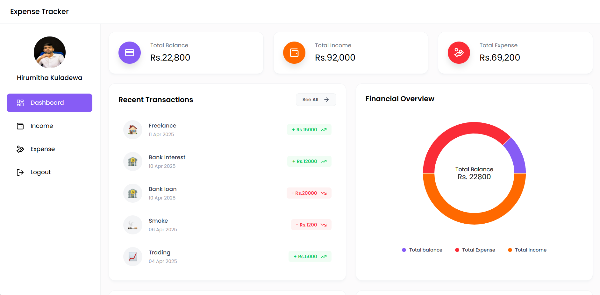

# 💸 Expense Tracker Frontend - MERN Stack
<p align="left">
  
  
  
</p>

<p align="center">
  
</p>

Welcome to the **Expense Tracker App** – a modern, responsive, and powerful frontend for managing your finances 💰. Built using **React + Vite** and styled with **Tailwind CSS**, this app integrates beautifully with a MERN backend to help users manage their incomes and expenses efficiently.

---

## 🚀 Features

✨ Smooth and responsive UI  
🔐 Login & Signup with token handling  
📊 Dashboard with visualized income/expense stats using `recharts`  
➕ Add Income / Expense with emoji support  
👁️ View and filter all entries  
🗑️ Delete transactions  
📥 Download data (Excel or PDF ready backend)  
📤 Logout with session clear  
🔥 Toast notifications for all major actions

---

## 🧰 Tech Stack & Libraries

| Category        | Technology          |
|-----------------|---------------------|
| ⚛️ Frontend     | React + Vite       |
| 🎨 Styling      | Tailwind CSS       |
| 🔗 Routing      | react-router-dom   |
| 📡 HTTP Client  | Axios              |
| 📆 Date Format  | moment.js          |
| 📈 Charts       | Recharts           |
| 😍 Emoji Picker | emoji-picker-react |
| 🔔 Toast Alerts | react-hot-toast    |
| 🎨 Icons        | react-icons        |

---

## 📸 Screenshots



---

## 📁 Folder Structure

```
src/
│
├── components/ 
├── context/  
├── hooks/ 
├── pages/ 
├── utils/
├── App.jsx
├── index.css
└── main.jsx
```

---

## 🛠️ Getting Started

1. **Clone the repo**
   ```bash
   git clone https://github.com/itz-Hiru/Expense-Tracker-MERN-Frontend.git
   cd Expense-Tracker-MERN-Frontend
   ```

2. **Install dependencies**
   ```bash
   npm install
   ```
   
3. **Run the app**
   ```bash
   npm run dev
   ```

   > Your app will start on `http://localhost:5173/`

---

## 📦 Backend Integration

Make sure you have the [MERN backend](https://github.com/itz-Hiru/Expense-Tracker-MERN-Backend) running. The frontend expects routes like:
- `POST /auth/login`
- `POST /auth/signup`
- `GET /transactions`
- `POST /transactions`
- `DELETE /transactions/:id`
- `GET /transactions/download`

---

## 🧑‍💻 Author

Developed with ❤️ by [@itz-hiru](https://hirumitha-portfolio.vercel.app)

---

## ⭐️ Show Your Support

If you like this project, leave a ⭐️ to show some love!

---

<p align="center">
  
</p>
